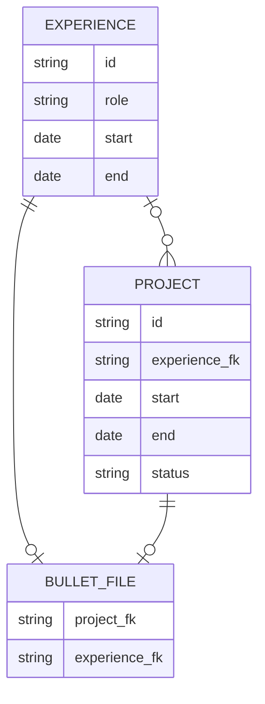
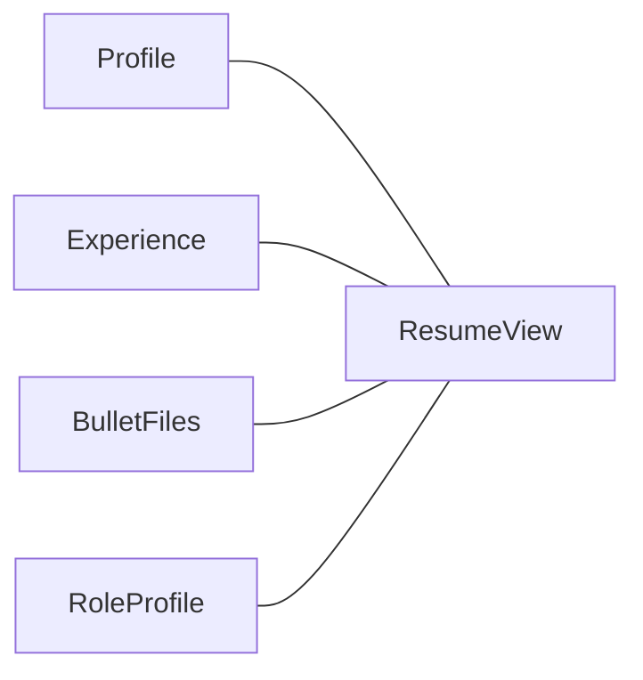

# ERD

* Project: may belong to one Experience.
* Personal projects: do not belong to an Experience.
* Bullet File: 
      may reference: 1 Project or 1 Experience; at least one FK must be populated.

# Inputs of ResumeView

